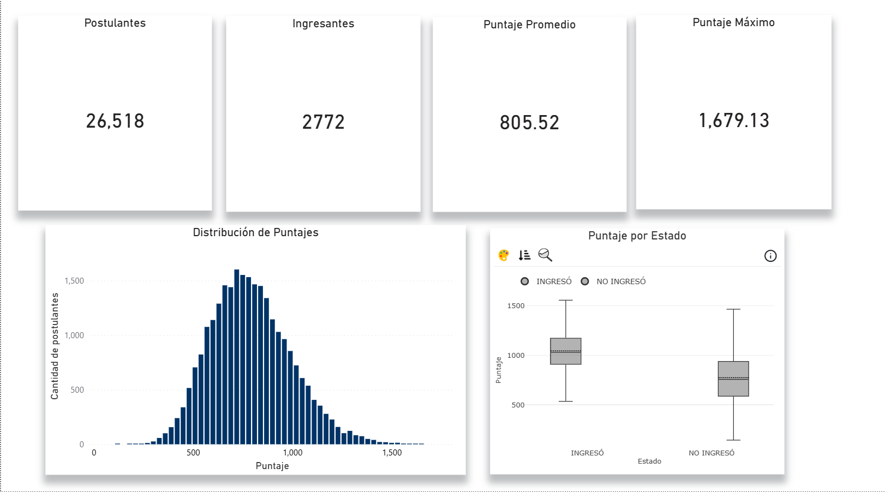
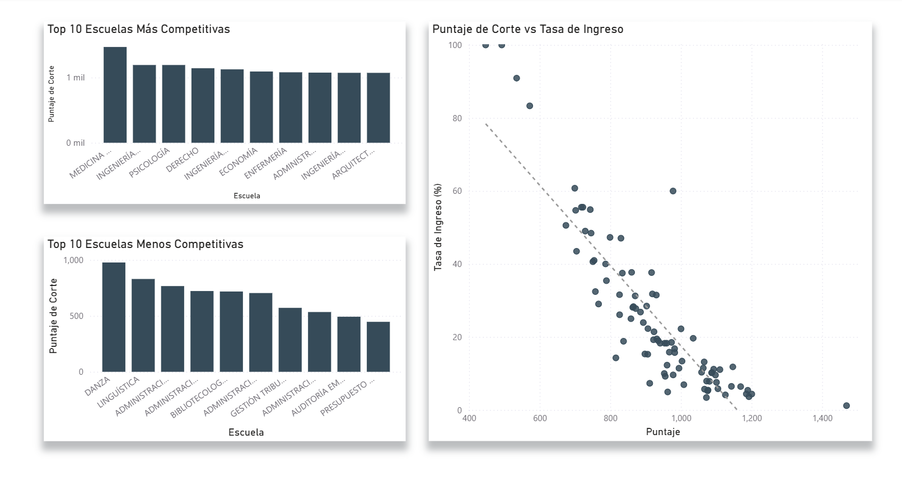
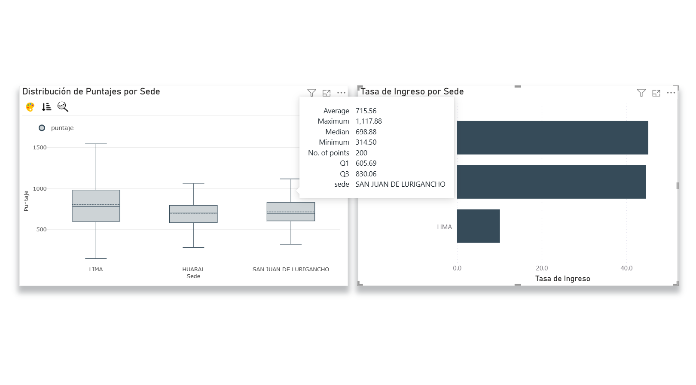

# UNMSM Admisión 2026-I: Web Scraping & EDA

Análisis exploratorio de datos (EDA) y dashboard interactivo sobre los resultados del examen de admisión de la Universidad Nacional Mayor de San Marcos (UNMSM) para el proceso 2026-I.

[](https://nbviewer.org/github/MathiuCz/UNMSM-Admision-2026-I/blob/main/notebooks/eda.ipynb)

Este proyecto de portafolio de Data Science combina **web scraping** con Selenium, **análisis exploratorio** con Python/Pandas y visualización de datos con **Power BI** para responder preguntas clave sobre la competitividad y las estrategias de admisión.

---

## Problema y Objetivos

Los postulantes carecen de información relevante para evaluar su postulación. El objetivo de este proyecto es proporcionar a los futuros postulantes una herramienta basada en datos para evaluar su estrategia de admisión a la UNMSM.

**Preguntas del problema:**
1. ¿Qué tan competitivo es realmente ingresar a San Marcos?
2. ¿Qué carrera debo elegir según mi puntaje estimado?
3. ¿Vale la pena postular a las sedes descentralizadas?

---

## Hallazgos Clave (Insights)

1. **El puntaje solo no determina el ingreso:** La admisión depende de la combinación entre puntaje y la demanda de la carrera elegida. Un puntaje alto no garantiza el ingreso si la escuela tiene alta competencia.
2. **Relación inversa puntaje/tasa de ingreso:** Existe una correlación inversa entre el puntaje de corte y la tasa de admisión por escuela. *Medicina Humana* es un outlier estructural con un corte de ~1,469 puntos (270 pts por encima del segundo lugar).
3. **La sede determina tu ingreso:** Las sedes descentralizadas (SJL y Huaral) tienen tasas de admisión significativamente mayores (~45%) comparadas con Lima (~10.1%), debido a una menor relación postulantes/vacantes.

---

## Stack Tecnológico

- **Lenguaje:** Python 3.14
- **Gestor de paquetes:** `uv`
- **Scraping:** Selenium (Edge Headless)
- **Análisis:** Pandas, NumPy, Matplotlib, Seaborn
- **Visualización:** Power BI Desktop
- **Entorno:** Jupyter Notebooks

---

## Estructura del Proyecto

```text
unmsm-admision-2026/
├── .venv/                  # Entorno virtual (uv)
├── data/
│   ├── raw/                # Datos crudos (CSV)
│   └── processed/          # Datos limpios y gráficos generados
├── notebooks/
│   └── eda.ipynb           # Análisis exploratorio completo (20 celdas)
├── src/
│   └── scraper.py          # Script de extracción de datos
├── dashboard/              # Archivos de Power BI
├── pyproject.toml          # Dependencias y configuración
└── README.md               # Documentación del proyecto
```

---

## Cómo ejecutar el proyecto

### 1. Configuración del entorno
Este proyecto utiliza `uv` para la gestión de dependencias y Python 3.14.

```bash
# Clonar el repositorio
git clone https://github.com/MathiuCz/Web-scraping-y-analisis-exploratorio-de-datos-del-Examen-de-Admisi-n-UNMSM2026-I.git
cd unmsm-admision-2026

# Crear entorno virtual e instalar dependencias
uv sync
```

### 2. Ejecutar el Scraper (Opcional)
Si deseas obtener los datos más recientes (requiere Edge instalado):

```bash
python src/scraper.py
```

**Nota:** El scraper guarda los archivos CSV en la carpeta `data/raw/`. Está pendiente de refactorización — úsalo con precaución.

### 3. Abrir el Notebook de EDA
```bash
jupyter notebook notebooks/eda.ipynb
```
*Asegúrate de seleccionar el kernel `venv_data_science` o `.venv`.*

### 4. Explorar el Dashboard
Abre el archivo `.pbix` en la carpeta `dashboard/` con **Power BI Desktop**.

---

## Dashboard





*Los visuales son interactivos — al seleccionar una escuela o sede, el resto de gráficos se actualiza automáticamente.*

---

## Métricas del Dataset

- **Total Postulantes:** 26,518
- **Ingresantes:** 2,772 (Tasa global: 10.45%)
- **Escuelas Profesionales:** 95 (83 en Lima, 12 en sedes)
- **Facultades:** 24
- **Sedes:** 3 (Lima, San Juan de Lurigancho, Huaral)

---

## Limitaciones y Notas de Calidad

- **Ausentes:** Se excluyeron 339 registros de postulantes ausentes del análisis de puntajes.
- **Escuelas vs Carreras:** El dataset trata cada combinación "Carrera + Sede" como una escuela independiente (95 entradas), lo cual es correcto para el análisis de admisión ya que cada combo tiene su propio pool de vacantes.
- **Arquitectura y Urbanismo:** Fue corregida en el dataset para pertenecer a la facultad FIGMMG, reduciendo el conteo de facultades de 25 a 24.

---

## Licencia

Este proyecto es de código abierto y fines educativos.
